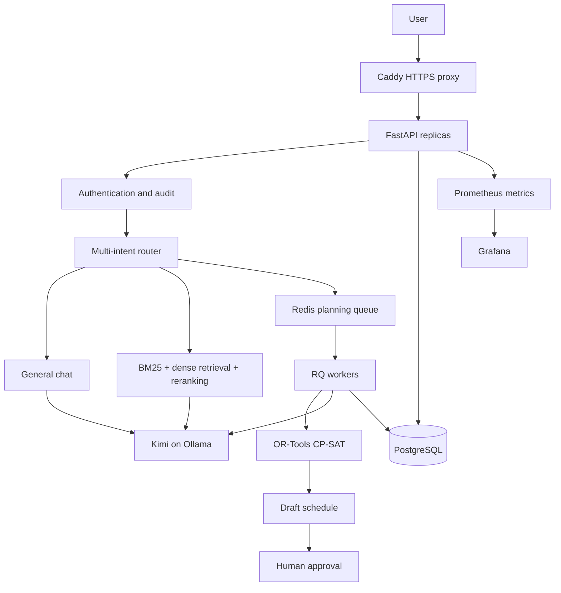

# Prometheus Planning AI

Prometheus is a production-oriented, private operations-planning assistant derived from OpsPlanning AI. It combines a React chat interface, FastAPI, local Kimi through Ollama, hybrid document retrieval, and OR-Tools CP-SAT scheduling. Operational data stays on infrastructure you control; no cloud LLM API is used by the application.

> This folder is repo-ready but has not been published. It is a staging/reference implementation, not a claim of production certification. The included single-PC tests cannot prove multi-node availability, real organizational capacity, backup recovery objectives, or security compliance.

## Architecture



Kimi interprets language and writes explanations. RAG supplies approved company evidence. OR-Tools makes and verifies resource assignments. Kimi never replaces the solver or invents SOP requirements, and schedules remain drafts until a human approves them.

## Phase 1–5 implementation

| Phase | Included here |
|---|---|
| 1 — application foundation | Central settings and production guards, PostgreSQL/SQLite SQLAlchemy persistence, Alembic migration, authentication/RBAC, audit/chat records, request IDs, request-size limits, Redis rate limiting, RQ jobs, liveness/readiness endpoints |
| 2 — containers | Multi-stage React/Python image, non-root runtime, PostgreSQL, Redis, API and worker services, Caddy HTTPS, internal backend network, health checks and CPU/RAM limits |
| 3 — observability | JSON logs, Prometheus HTTP/solver metrics, alert rules, Grafana data source and optional OTLP traces |
| 4 — validation | 46 inherited unit/integration tests plus API percentile benchmark, RAG recall evaluator, security smoke test, GPU/CPU/RAM capture and explicit acceptance thresholds |
| 5 — future scale | Kustomize manifests for replicated API/workers, HPA, disruption budget, network policies, persistent data, ingress and an optional NVIDIA GPU Ollama workload |

## Run locally on this PC

### Easiest option: desktop shortcut

Double-click **Prometheus Planning AI** on the desktop. The launcher starts Ollama and the local web application, waits until they are ready, and opens the chat automatically. On first use it also creates the sanitized example workbook and provisions `planning-kimi` if either is missing. First-time model provisioning can take considerably longer and requires internet access; later launches use the local copy.

If startup fails, the launcher displays an error and writes diagnostic logs under `data/`.

### Manual option

Ollama remains outside Docker for the easiest Windows/NVIDIA setup. These limits protect desktop responsiveness:

```powershell
$env:OLLAMA_NUM_PARALLEL="1"
$env:OLLAMA_MAX_LOADED_MODELS="1"
$env:OLLAMA_MAX_QUEUE="64"
ollama serve
```

In another terminal:

```powershell
cd C:\Users\USER\OneDrive\Desktop\projects\prometheus
.\.venv\Scripts\Activate.ps1
python scripts\create_example_workbook.py
python scripts\run_web.py
```

Open `http://127.0.0.1:8010`. Put the private workbook in `data/planning.xlsx` and approved PDF, DOCX, TXT, MD, CSV, or XLSX material in `documents/`. Both directories are ignored by Git except sanitized examples/placeholders.

## Simulate an in-house server with Compose

1. Copy `.env.production.example` to `.env.production`.
2. Replace every example password/secret. Ensure `DATABASE_URL` contains the same PostgreSQL password.
3. Add `127.0.0.1 planning.local` to the Windows hosts file with administrator rights.
4. Start Ollama with the limits above, then run:

```powershell
docker compose -f compose.production.yaml up --build -d
docker compose -f compose.production.yaml ps
docker compose -f compose.production.yaml logs -f api worker
```

Use `https://planning.local` and accept/install Caddy's local CA only on controlled test devices. Grafana is exposed only on `http://127.0.0.1:3000`. PostgreSQL and Redis are not host-exposed.

As load grows, scale CPU services independently:

```powershell
docker compose -f compose.production.yaml up -d --scale api=3 --scale worker=3
```

Do not increase Kimi parallelism first: each parallel generation increases model context memory. With one 16 GB GPU, one loaded model and one generation is the safe baseline; use measured VRAM headroom before changing it.

## Validation

Run static and inherited checks:

```powershell
powershell -ExecutionPolicy Bypass -File validation\run_phase4.ps1
```

With the stack running, capture representative results:

```powershell
.\.venv\Scripts\python.exe validation\benchmark_api.py --url https://planning.local --requests 500 --concurrency 25
.\.venv\Scripts\python.exe validation\security_smoke.py --url https://planning.local
.\.venv\Scripts\python.exe validation\hardware_monitor.py --seconds 300
```

Use realistic simple-chat, RAG, planning, simultaneous-user, failure/restart, backup/restore, and 1–4 hour soak workloads. Compare results with `validation/acceptance.json`; tune from evidence. Report chat latency, solver latency, queue wait, p50/p95/p99, errors, RAG recall, schedule feasibility, CPU/RAM, GPU utilization/VRAM, thermals, and power separately.

## Backups

```powershell
powershell -File scripts\backup_postgres.ps1
powershell -File scripts\restore_postgres.ps1 -Backup backups\planning-YYYYMMDD-HHMMSS.sql -IUnderstandThisOverwritesDatabase
```

Test restores regularly and store encrypted copies outside this machine. A backup that has never been restored in a drill is not yet proven.

## Kubernetes future target

Render without changing a cluster:

```powershell
kubectl kustomize deploy\kubernetes\overlays\production
```

Before any real deployment, publish a versioned image, replace the example Secret through your secret manager, provide ReadWriteMany document storage, configure TLS/DNS/ingress, install metrics and NVIDIA device plugins where needed, and choose an operated PostgreSQL backup/HA design. The optional GPU manifest is under `deploy/kubernetes/optional`; it is intentionally not applied by the base overlay.

Kubernetes is useful when there are multiple nodes/users and requirements for rolling deployment, self-healing and horizontal scaling. It does not manufacture high availability on one PC, and one physical GPU remains one inference bottleneck.

## Important security and operating notes

- Production settings refuse disabled authentication, short signing secrets, SQLite, and non-allow-listed LLM hosts.
- The production stack has no direct internet dependency at runtime after images/models are present, but container/image and model downloads do use the internet during setup. Pin and scan artifacts before an air-gapped deployment.
- Workbook and document permissions still need host/storage access controls. Application authentication cannot protect files that users can open directly from the server disk.
- Replace the example Kubernetes Secret before use; never commit the real `.env.production`, certificates, workbooks, documents, databases, logs, backups, or model credentials.
- Human approval is enforced as schedule state, but organization-specific segregation of duties and approval policy must be configured and tested with the client.
